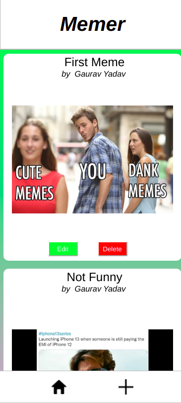

# Memer

An Android Application for sharing Memes. Memes can be shared via a link or
by uploading an image. Additional Functionalities of Deleting and Updating 
Memes is also Available


## Tech Stack

**Client :** Expo, TypeScript \
**Server :** Node.js \
**Database :** Mongo Atlas


## API Reference

#### Get all memes

```http
  GET /app/feed
```

#### Get a meme

```http
  GET /app/feed/${id}
```

| Parameter | Type     | Description                       |
| :-------- | :------- | :-------------------------------- |
| `id`      | `string` | **Required**. Id of meme to fetch |

### Post a meme

```http
  POST /app/feed
```

| Parameter | Type     | Description                       |
| :-------- | :------- | :-------------------------------- |
| `name`      | `string` | **Required**. Name of the user |
| `title`      | `string` | **Required**. Title of the meme |
| `data`      | `string` | **Required**. Meme url or an image in base64 |

#### Delete a meme

```http
  DELETE /app/feed/${id}
```

| Parameter | Type     | Description                       |
| :-------- | :------- | :-------------------------------- |
| `id`      | `string` | **Required**. Id of meme to be deleted |

#### Update a meme

```http
  PATCH /app/feed
```

| Parameter | Type     | Description                       |
| :-------- | :------- | :-------------------------------- |
| `name`      | `string` | **Required**. Name of the user |
| `title`      | `string` | **Required**. Title of the meme |
| `data`      | `string` | **Required**. Meme url or an image in base64 |


## Run Locally

Clone the project

```bash
  git clone https://github.com/theydvgaurav/M3m3r
```

Go to the project directories and Install dependencies

```bash
  cd M3m3r && cd m3m3r-client && npm install
```
```bash
  cd M3m3r && cd m3m3r-server && npm install
```

Start the Backend Server

```bash
  npm start
```
Start the application

```bash
  npm start
```


## Screenshots

<div align="center">
     
    
</div>


## Authors

- [Gaurav Yadav](https://www.github.com/theydvgaurav)

